```mermaid
flowchart LR;
    A[**Developer Commit**] --> B[**GitHub**];
    B --> C[**Jenkins CI Job**];
    C --> D[**Build Docker Image**];
    D --> E[**Push to Docker Hub**];
    E --> F[**Argo CD Pull Image**];
    F --> G[**Deploy to Kubernetes**];
    G --> H[**Monitoring with Prometheus**];
    G --> I[**Visualization with Grafana**];

    classDef commitStyle stroke:#ffcc00,stroke-width:2px,fill:none;
    classDef githubStyle stroke:#181717,stroke:#fff,color:#fff,stroke-width:2px,fill:none;
    classDef jenkinsStyle stroke:#f7df1e,stroke-width:2px,fill:none;
    classDef buildStyle stroke:#99cc66,stroke-width:2px,fill:none;
    classDef pushStyle stroke:#cc99ff,stroke-width:2px,fill:none;
    classDef argoStyle stroke:#a2d5f2,stroke-width:2px,fill:none;
    classDef deployStyle stroke:#66ffcc,stroke-width:2px,fill:none;
    classDef monitoringStyle stroke:#ff9966,stroke-width:2px,fill:none;
    classDef grafanaStyle stroke:#ffcc00,stroke-width:2px,fill:none;

    class A commitStyle;
    class B githubStyle;
    class C jenkinsStyle;
    class D buildStyle; 
    class E pushStyle;
    class F argoStyle;
    class G deployStyle;
    class H monitoringStyle;
    class I grafanaStyle;

```

# High Availability CI/CD Workflow for Logistic Service 🚚🔄

## Project Highlights 🎯

- **Configure Jenkins for CI** 🛠️: Set up Jenkins for Continuous Integration to automate code building and testing.
- **Configure Argo CD for CD** 🚀: Deploy Argo CD for Continuous Deployment to sync changes in Kubernetes automatically.
- **Code Analysis & Security with SonarQube** 🔍: Integrate SonarQube for static code analysis, ensuring security and quality.
- **Monitoring and Observability with Prometheus & Grafana** 📊: Implement monitoring of Kubernetes with Prometheus and create dashboards with Grafana.

## Workflow Overview 🔄

Whenever a developer commits code, the following process is triggered:
1. **Jenkins**: Dockerizes the application, pushes it to DockerHub, and modifies the Kubernetes deployment file with the latest image.
2. **Argo CD**: Automatically syncs with the modified deployment file and deploys the new image to the Kubernetes cluster.

---

## Steps to Set Up 📝

### Step 1: Create Jenkins Server & Kubernetes Cluster 🚀
1. Install **Jenkins**.
2. Set up **Docker** and **SonarQube** in containers.
3. Configure Kubernetes cluster access in Jenkins.
4. Install **Docker Pipeline Plugin** and **Sonar Scanner Plugin** in Jenkins.

### Step 2: Create Jenkins Pipeline 🔧
1. Configure the pipeline for:
   - **Code analysis** with SonarQube.
   - **Docker image build** and push.
   - **Modify the deployment file**.
   - **Cleanup process** post-deployment.

### Step 3: Create SonarQube Project & Access Token 🔑
1. Create a new project in **SonarQube**.
2. Generate an **access token** for Jenkins integration.

### Step 4: Deploy ArgoCD in Kubernetes 🚢
1. Install **ArgoCD** in the Kubernetes cluster.
2. Change the service from **ClusterIP** to **LoadBalancer** for external access.

### Step 5: Create New Application in ArgoCD 🔄
1. Add a new application in ArgoCD.
2. Provide the details of the application and GitHub repository.
3. Set sync to **Automatic** for continuous deployment.

### Step 6: Create Service File for External Access 🌍
1. Create a **Service** file for **logistic.com** for external access using a **LoadBalancer**.

### Step 7: Add Webhook for Jenkins in GitHub 🔔
1. Add a **Webhook** in **GitHub** to automatically trigger Jenkins whenever there is a commit or push event to the repository.

### Step 8: Configure Monitoring with Prometheus & Grafana 📊
1. Install **Prometheus** and **Grafana** in the Kubernetes cluster for monitoring.
2. Create custom **Grafana Dashboards** for visualizing metrics and monitoring the production environment.

---

## Contribution 👨‍💻

- **Created this CI/CD workflow** to automate the developer code lifecycle.
- **Integrated security concerns** by adding SonarQube for static code analysis.
- **Set up monitoring and observability** using Prometheus and Grafana for real-time insights into the Kubernetes production cluster.

---

## Technologies Used 💻

- **Jenkins** 🛠️
- **ArgoCD** 🚀
- **SonarQube** 🔍
- **Prometheus** 📊
- **Grafana** 📈
- **Docker** 🐳
- **Kubernetes** 🚢
- **GitHub** 🐙

---

## Getting Started 🚀

1. Clone the repository: `git clone https://github.com/your-username/logistic-service-ci-cd.git`
2. Follow the steps mentioned above to set up each component.
3. Enjoy a fully automated CI/CD pipeline for your logistic service! 🎉

---

For more details, check out the respective official documentation of Jenkins, Argo CD, SonarQube, Prometheus, and Grafana. 📚
